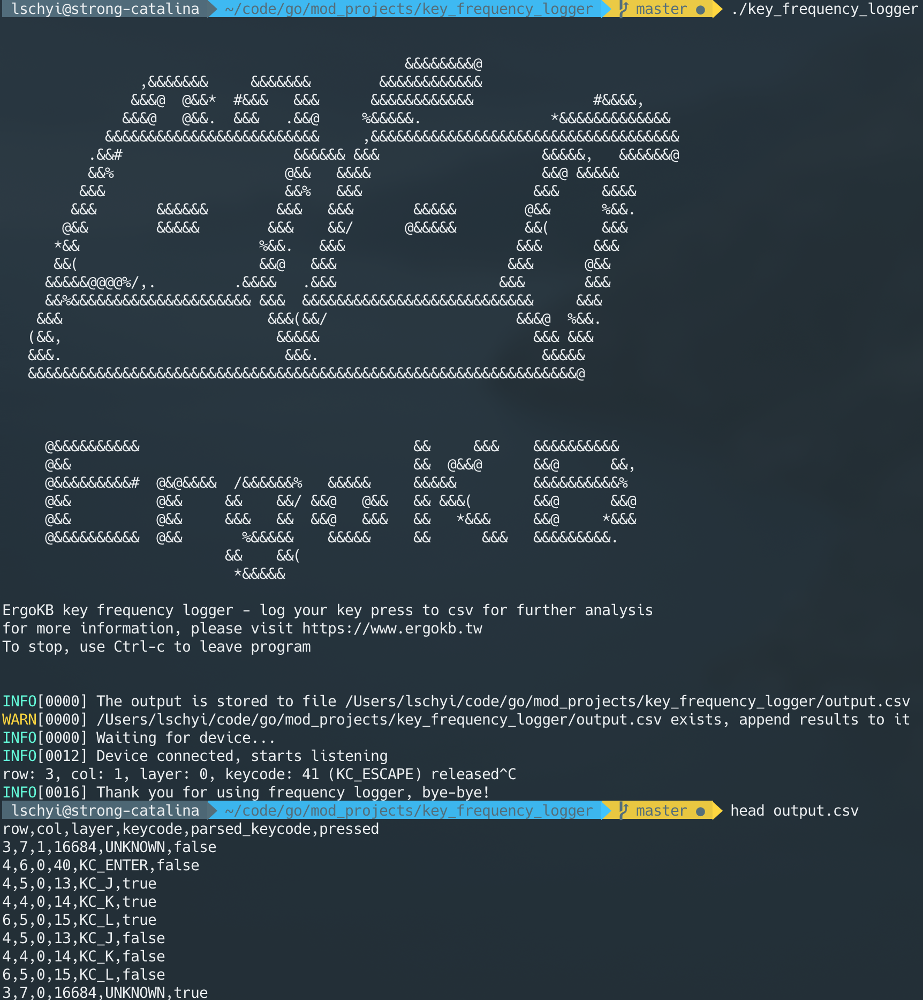

# Key Frequency Logger

Key frequency logger is a logger which helps you log out every keystrok from [TMK](https://github.com/tmk/tmk_keyboard) and [QMK](https://github.com/qmk/qmk_firmware), and stores it into CSV format. You can adopt this data to analysis, and create better keymaps for yourself!



## Run

```
$ ./key_frequency_logger [-o filepath]
```

By default, the output file would be generated right beside the executable. You can use -o option to specify different file path.

## Set Messages in Keyboard

You can make whatever TMK or QMK compatible keyboards use this logger, as long as you output the debug message as below:

```
ErgoKB:COL,ROW,PRESSED,LAYER,KEYCODE\n
```

, where `COL` is the column, `ROW` is the row for that key; `PRESSED` could be 0 or 1, where 0 means released, 1 means pressed; `LAYER` is the current keymap layer, `KEYCODE` is the keycode. An valid example would be 

```
ErgoKB:4,6,0,1,40\n
```

, which means the switch at column 4, row 6 is released, and current layer is 1 with the released keycode  40.

An easy way of adding such message is to add the following peace of code into your `keymap.c` file: 

```c
#include <debug.h>

uint8_t current_layer = 0;

layer_state_t layer_state_set_user(layer_state_t state) {
	current_layer = get_highest_layer(state);
	return state;
}

bool process_record_user(uint16_t keycode, keyrecord_t *record) {
	uprintf("ErgoKB:%u,%u,%u,%u,%u\n", record->event.key.col, record->event.key.row, record->event.pressed, current_layer, keycode);
	return true;
}
```

, and remember to turn on the option `CONSOLE_ENABLE = yes`.